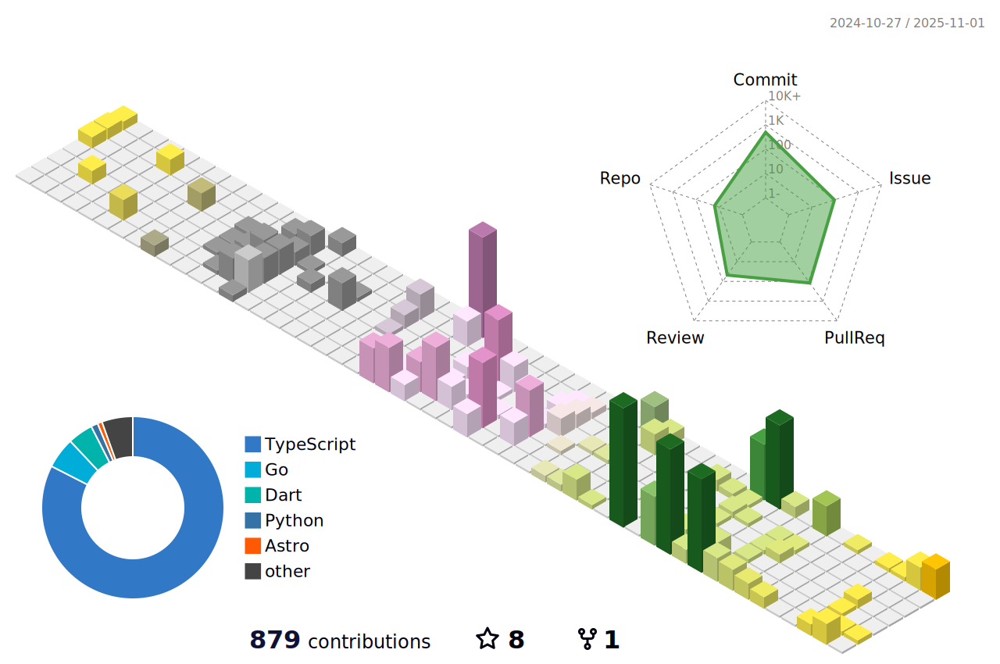

# takara2314 (Takara Hamaguchi) / Foxseed

Konnichiwa! I'm takara2314 (a.k.a. Foxseed), a graduate from a KOSEN. I like Minecraft, kemono (furry), Doraemon,
kawaii things, programming, etc. I'm interested in all of IT. I do my best to code a lot.

## 👨🏽‍💻 Works

### 💼 Professional & Contest Projects

- [Kadai Store API](https://github.com/takara2314/kadai-store-api): A API
  providing assignments information by using
  [devoirs-core](https://github.com/approvers/devoirs-core)
- [2314.tk](https://github.com/takara2314/2314.tk): My portfolio
- 学魚養食: A system that students can help fish farmers with using what them
  learned in the school _(Introduced in
  [第32回高専プロコン](https://youtu.be/GpcsrOywmHA?t=21897))_
- [MARINE TRASHART](https://github.com/ezaki-lab/2022-trashart): A PWA that
  children dispose of marine trash by crafting the art _(Introduced in
  [第33回高専プロコン](https://youtu.be/wSapbCyDciY?t=20187))_
- [B-SAM](https://github.com/takara2314/bsam): Sailing Assist App for visually
  impaired athletes
- りぷら®: A system and A app that classificate type of plastic to recycle certainly _(Introduced in
  [DCON2023](https://dcon.ai/2023/products/%E3%82%8A%E3%81%B7%E3%82%89/))_
- [御景サーバー ウェブサイト](https://github.com/Mikage-Server/website): Website for Mikage Server (a Minecraft survival server)
- [Tobamaru Project Team ホームページ](https://github.com/takara2314/3rd-tobamaru-lastyear): Website for Tobamaru Project Team
  ("Tobamaru" is a training ship owned by NIT Toba College)
- [志摩市二十歳の集い ホームページ](https://github.com/takara2314/shima-hatachi-2024): Website for the 2024 Shima City Twenty-Year-Old Gathering
  (former Coming-of-Age Ceremony)
- [バーチャルケモナイト LP](https://github.com/foxseedlab/vkemonight-lp): Landing Page for VIRTUAL KEMO NIGHT (a virtual event for furry fans and DJ fans)

### 🧩 Hobby Projects

- [TCJ2 Kadai Store](https://github.com/takara2314/tcj2-kadai-store): A system
  to add schedule about homework to my class TimeTree
- [たからーん年賀状AR 2021](https://github.com/takara2314/nenga2021): My New
  Year's cards 2021 included AR
- [AwareShe](https://github.com/takara2314/awareshe): 2D girl icon generator by
  PGGAN _(Jointly developed with [kosakae256](https://github.com/kosakae256))_
  **(He installs the functions about AI, not me.)**
- [EmoFace](https://github.com/kosakae256/EmoFace): A face to kaomoji generator
  by [JCV 属性分析SDK](https://www.japancv.co.jp/solutions/insight_sdk/)
  _(Jointly developed with [kosakae256](https://github.com/kosakae256))_
- [劣化版カンジー博士](https://github.com/takara2314/downgraded-dr.kanji):
  Quizzing kanji in exam bot
- [kadai-alarm](https://github.com/takara2314/kadai-alarm): Notice forgetting to
  submit assignments system
- [ふぉくしーどAR](https://github.com/foxseedlab/foxseed-ar): WebAR content for my character business cards

... [others](https://2314.world/works)

## 🏆 Awards

- 第32回 全国高等専門学校 プログラミングコンテスト 課題部門 最優秀賞
- 第33回 全国高等専門学校 プログラミングコンテスト 自由部門 敢闘賞
- 第20回 キャンパスベンチャーグランプリ 中部大会 奨励賞
- 第4回 全国高等専門学校ディープラーニングコンテスト (DCON2023) 経済産業大臣賞

## 👨🏽‍🔬 Doings

- Working as a Software Engineer at [CyberAgent, Inc.](https://www.cyberagent.co.jp/)
- Developing and operating a sailing assist app for visually impaired athletes
- Actively developing in several kemono (furry) communities

## 😀 Nicknames

- たからーん
- たからん
- ふぉくしーど
- ふぉく

## ➡️ Links

- X(Twitter): [たからーん (@takara2314)](https://x.com/takara2314)
- X(Twitter) for hobbies: [ふぉくしーど (@foxseed2314)](https://x.com/foxseed2314)
- Portfolio: [2314.world](https://2314.world/)
- Wantedly: [濱口 宝](https://www.wantedly.com/id/HamaguchiTakara)
- Qiita: [takara2314](https://qiita.com/takara2314)
- Discord: takara2314
- Minecraft: takara2314
- VRChat: [ふぉくしーど](https://vrchat.com/home/user/usr_e57810c0-25d0-4aee-b469-242ea7570f01)

